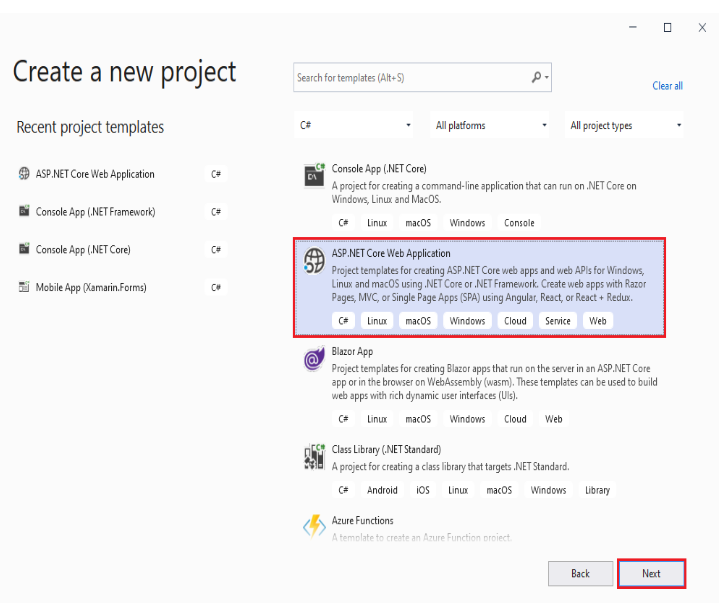

#Building ASP.NET Web API In .NET Core With Entity Framework

##Background

ASP.NET Web API is a framework that helps to build HTTP(s) services that connect to a wider range of clients, 
including browsers and mobile devices.
ASP.NET Web API is an ideal platform for building RESTful applications.
In this App , we we will build a simple Web API with Read, Create, Update and Delete action with HTTP verbs 
of GET, POST, PUT and DELETE respectively and will test the Web APIs with the Postman tool.
Here will consider a simple and basic model as ‘Employee’ and will use an Entity Framework with SQL Server database.

#`Prerequisites`
    1.Visual studio 2019 or Visual Studio Code or Rider IDE or Visual Studio Code
    2.Postman Tool
    3.SQL Server Management Studio 18
    4.SQL Server 2019
    
#Part A - Implementation of Entity Framework

    1.Step 1 - Open the IDE
    Here will use the IDE - Visual Studio and select the project type as “ASP.NET Core Web App”.
    
    
    2.Step 2
    Give the project name and click on Create, proceed with the type of Web Application.
    
    
    3.Step 2
    Choose the API option to create a default project with ASP.NET core RESTful HTTP services.  
    
    
    4.Step 4
    Now, you should able to see the project as below. Will delete the default files highlighted in Red
    
    
    5.Step 5
   Install following Nuget packages with NuGet package Manager and installed packages as below,
    
